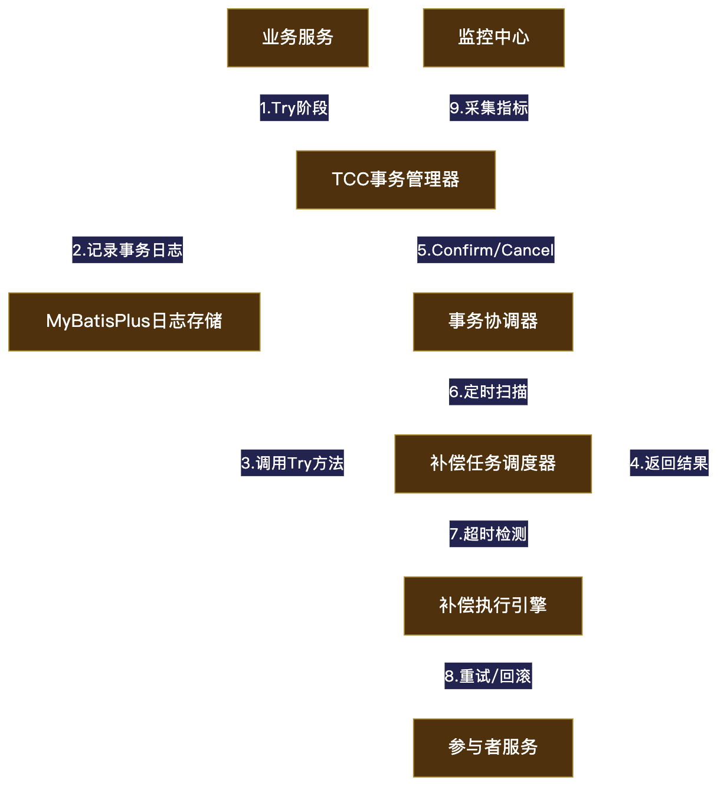

# tcc 分布式事务模块
    tcc为三阶段提交需包含try confirm cancel三个接口
    1. 在配置文件（yml,properties）中配置TccProperty类中相关属性（控制开关）
    2、在开始入口接口使用@TccGlobalTx，标记全局事务入口
    3、在分支try接口使用@TccBranchTx，标记分支事务入口

调度示意图：

示例：
入口：

    @PostMapping("createOrder")
    @TccGlobalTx(bizType = "createOrder")
    public ResultVO<Boolean> createOrder(@RequestBody @Validated InitDataDTO entity) {
        final String urlPrefix = String.format("%s%s", NetWorkConstant.LB_PREFIX, MgtConstant.MGT_SERVER_NAME);
        final ResultVO<Boolean> result =
            this.httpClientExecutorRegistry.getHttpClientExecutor(HttpClientTypeEnum.REST_CLIENT)
            .post(
                urlPrefix + "/init/tryA",
                JacksonUtil.toJsonStr(entity),
                null,
                new TypeReference<>() {
                }
            );
        result.errorThrow();
    
        final String urlPrefix2 = String.format("%s%s", NetWorkConstant.LB_PREFIX, SetupConstant.SETUP_SERVER_NAME);
        final ResultVO<Boolean> result2 =
            this.httpClientExecutorRegistry.getHttpClientExecutor(HttpClientTypeEnum.REST_CLIENT)
                .post(
                    urlPrefix2 + "/init/tryB",
                    JacksonUtil.toJsonStr(entity),
                    null,
                    new TypeReference<>() {
                    }
                );
        result2.errorThrow();
        Boolean data = true;
        return ResultVO.success(data);
    }

    分支一：

    @PostMapping("tryA")
    @TccBranchTx(confirmUrl = "/init/confirmA", cancelUrl = "/init/cancelA")
    public ResultVO<Boolean> tryA(@RequestBody @Validated InitDataDTO entity) {
        Boolean data = true;
        return ResultVO.success(data);
    }
    
    @PostMapping("confirmA")
    public ResultVO<Boolean> confirmA(@RequestBody @Validated InitDataDTO entity) {
        Boolean data = true;
        return ResultVO.success(data);
    }
    
    @PostMapping("cancelA")
    public ResultVO<Boolean> cancelA(@RequestBody @Validated InitDataDTO entity) {
        Boolean data = true;
        return ResultVO.success(data);
    }

    分支二：

    @PostMapping("tryB")
    @TccBranchTx(confirmUrl = "/init/confirmB", cancelUrl = "/init/cancelB")
    public ResultVO<Boolean> tryB1(@RequestBody @Validated InitDataDTO entity) {
        Boolean data = true;
        return ResultVO.success(data);
    }

    @PostMapping("confirmB")
    public ResultVO<Boolean> confirmB(@RequestBody @Validated InitDataDTO entity) {
        Boolean data = true;
        return ResultVO.success(data);
    }

    @PostMapping("cancelB")
    public ResultVO<Boolean> cancelB(@RequestBody @Validated InitDataDTO entity) {
        Boolean data = true;
        return ResultVO.success(data);
    }
